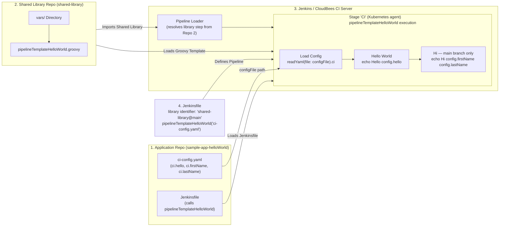

# sample-app-helloWorld

A minimal sample application used as a **training reference** for the CloudBees CI / Jenkins Pipeline template labs.
It contains no production code — its sole purpose is to demonstrate how an application repository is structured
when adopting the **Pipeline-as-Code** pattern with a centralised Shared Library.

---

## Purpose

| Goal | Detail |
|------|--------|
| Demonstrate `ci-config.yaml` | Shows how per-application CI configuration is declared and consumed by the shared pipeline template |
| Shared Library integration | Works with `pipelineTemplateHelloWorld` from `shared-library` |
| Lab exercises | Used in the *Hello World* lab series (templates `0-helloWorld` and `1-helloWorld-MB`) |

---

## Repository Structure

```
sample-app-helloWorld/
├── Jenkinsfile           # Imports shared-library and invokes pipelineTemplateHelloWorld
├── ci-config.yaml        # Application-level CI configuration consumed by the pipeline template
└── README.md             # This file
```

---

## Pipeline Design



---

## ci-config.yaml Reference

```yaml
app: 'Hello World'        # Human-readable application name
ci:
  hello: world            # Example custom CI parameter passed to the shared library
  firstName: Andreas      # Passed to helloWorld shared library step
  lastName: Caternberg    # Passed to helloWorld shared library step
```

All keys under `ci:` are forwarded to the pipeline template as a `Map config` and are accessible
inside Groovy shared library steps via `config.ci.<key>`.

---

## How It Is Used

The `Jenkinsfile` in this repository dynamically imports `shared-library` and invokes the
`pipelineTemplateHelloWorld` step, passing it the *path* to `ci-config.yaml` (not a pre-parsed map —
the shared library step reads and parses the YAML itself):

```groovy
library identifier: "${env.SHAREDLIB_GIT_REPO}@${env.SHAREDLIB_GIT_TAG_}", retriever: modernSCM(
        [$class: 'GitSCMSource',
         remote: "${env.SHAREDLIB_GIT_SERVER}/${env.SHAREDLIB_GIT_ORG}/${env.SHAREDLIB_GIT_REPO}.git",
         credentialsId: "${env.SHAREDLIB_GIT_CREDENTIALS}"
        ]
)

pipelineTemplateHelloWorld('ci-config.yaml')
```

The `env.SHAREDLIB_GIT_SERVER`, `env.SHAREDLIB_GIT_ORG`, `env.SHAREDLIB_GIT_REPO`, `env.SHAREDLIB_GIT_TAG`,
and `env.SHAREDLIB_GIT_CREDENTIALS` vars each default to a sensible value in the `Jenkinsfile` but can be
overridden at **Folder** or **Controller** level so the correct version/location of the shared library is
loaded without modifying the `Jenkinsfile`.

Inside `pipelineTemplateHelloWorld`, a dedicated "Load Config" stage runs `readYaml(file: configFile).ci`,
so the values it prints (`config.hello`, `config.firstName`, `config.lastName`) correctly resolve to the
keys nested under `ci:` in `ci-config.yaml`.

---

## Related Resources

- [`shared-library/vars/pipelineTemplateHelloWorld.groovy`](https://github.com/pipeline-training-ws/shared-library/blob/main/vars/pipelineTemplateHelloWorld.groovy)
- [`template-catalog/templates/0-helloWorld/Jenkinsfile`](https://github.com/pipeline-training-ws/template-catalog/blob/main/templates/0-helloWorld/Jenkinsfile)
- [`template-catalog/templates/1-helloWorld-MB/Jenkinsfile`](https://github.com/pipeline-training-ws/template-catalog/blob/main/templates/1-helloWorld-MB/Jenkinsfile)
- [CloudBees CI Shared Libraries documentation](https://docs.cloudbees.com/docs/cloudbees-ci/latest/pipelines/shared-libraries)
